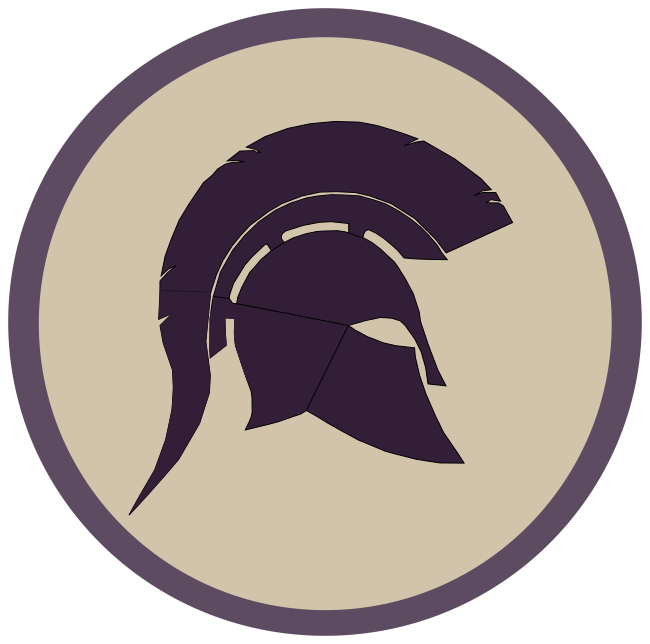

# Achille

**Fitness App**

# Achille (Fitness app)

**Achille** is a free and open source Fitness tracking app, made with React Native.

## Tech Stack

Following packages were used to build this project:

- [Expo](https://docs.expo.dev/)
- [React Native](https://reactnative.dev/)
- [React Navigation](https://reactnavigation.org/)
- [Firebase](https://firebase.google.com/)
- [Styled Components](https://styled-components.com/docs/basics#react-native)
- [Redux Toolkit](https://redux-toolkit.js.org/)

## Build

- yarn

## Firebase config

You have to register a project to firebase and then update the file

> src/config/firebase/config.tsx

accordingly.
If you own the rights to this repository, just execute

> echo $FIREBASE_API_KEY

> echo $FIREBASE_PROJECT_ID

and update the file with these values, or otherwise you can access firebase console and get the values from there.

## Run (Metro)

- npm install -g expo-cli (if you don't have expo installed)
- npx expo login
- Input your username & password
- npx expo start --tunnel

## Run (Local)

To run locally you'll need to setup either Android Studio or xCode.

### Android Studio

Follow this [guide](https://docs.expo.dev/workflow/android-studio-emulator/) to setup Android Studio.
After this, you can run

> npx expo start

And when the QR code will show, you can press 'a' to start the android emulator

## Build application executable

Follow this [guide](https://docs.expo.dev/build/setup/) to build Android or IOS executables.

### Android APK

To generate an .apk, run:

> eas build -p android --profile previewAndroid
